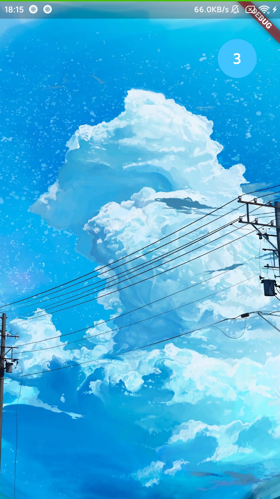
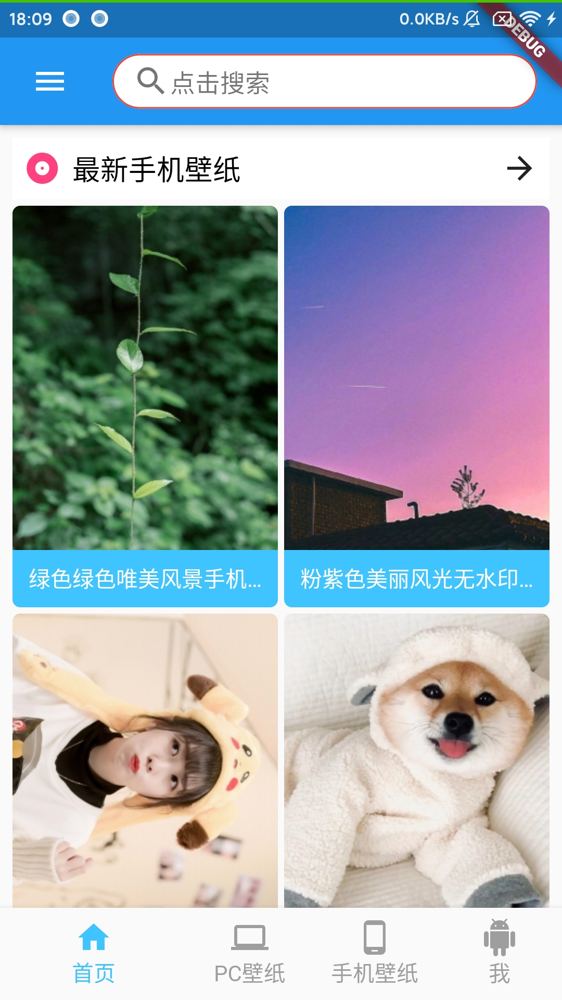
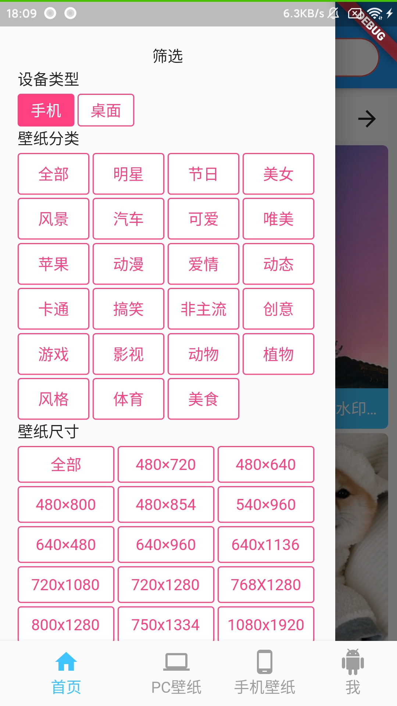
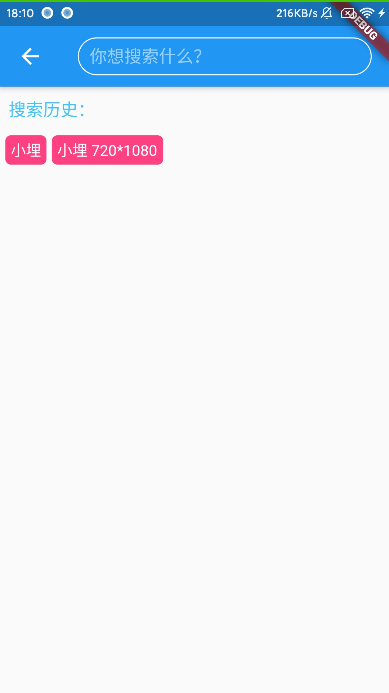
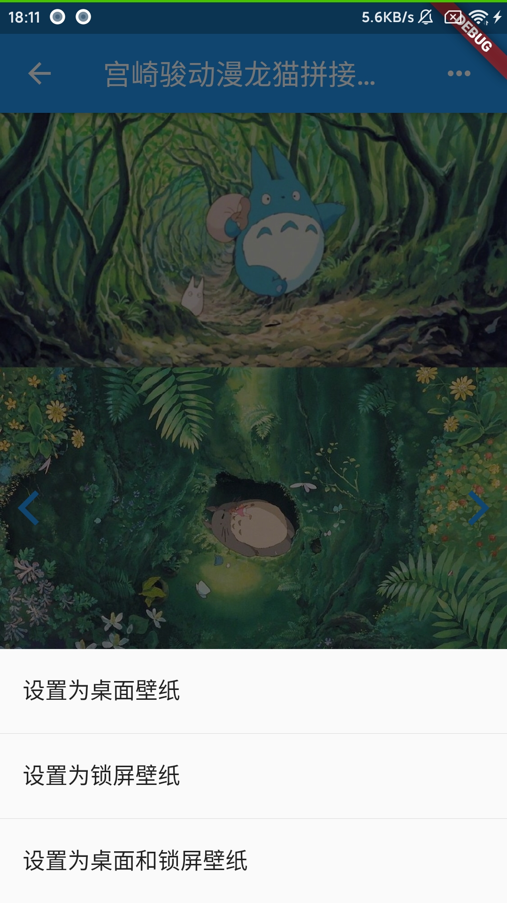
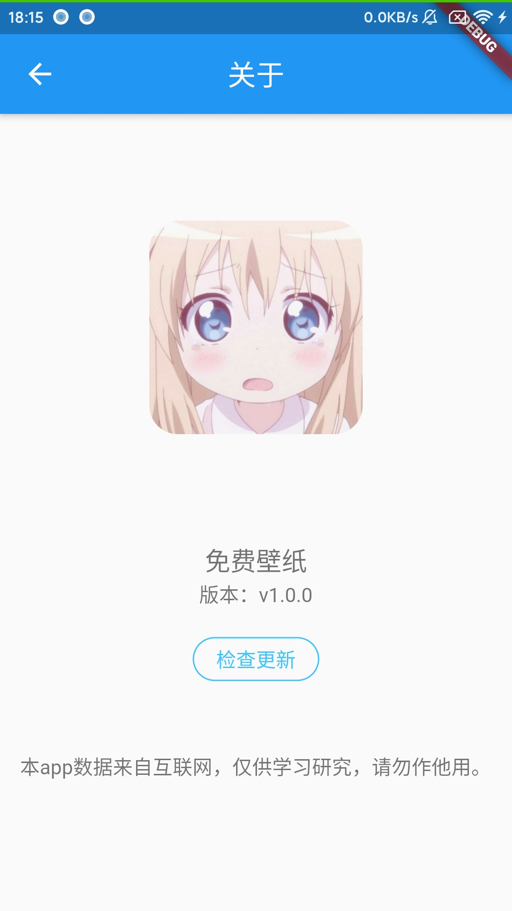

# free_wallpaper

一款基于flutter的免费Android壁纸应用

## 项目明细

环境：

android studio 3.5

Flutter 1.12.13+hotfix.7 • channel stable 

Framework • revision 9f5ff2306b 

Engine • revision a67792536c

Tools • Dart 2.7.0

## 主要功能

1.分端浏览

2.筛选功能

3.搜索功能

4.搜索历史记录

5.下载壁纸和设置壁纸

6.下载管理

(更多功能还在陆续填坑中...)

## 预览

    
    
    
    
    
    
    
    
    
    
    
    
    

## 下载体验

## 声明

本项目所有数据均来自互联网，仅供学习研究，请勿做它用。
